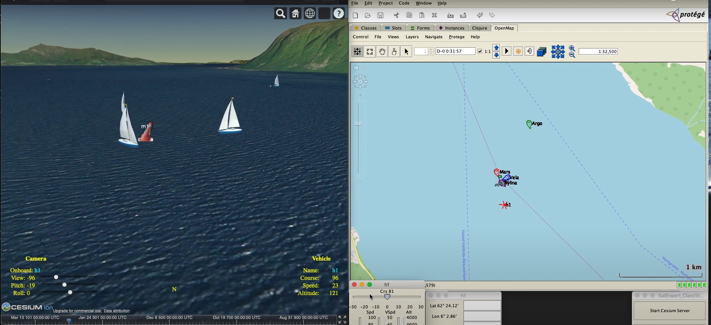

# sail-pro

Simulation and modelling environment for virtual sailing.



## Prerequisites

You need to be installed on your machine:

1. Java Runtime Environment

2. [Git](https://git-scm.com/) (optional, you can download project from Github, button "Code" on project page)

4. [VR Dashboard](https://martinez58400.wixsite.com/navigationvirtuelle/vr-dashboard?lang=en)


## Installation

Download sail-pro from github:

```clj
$ cd <..>
$ git clone https://github.com/rururu/sail-pro.git     # optional, see above
$ cd sail-pro
```
## Start

```clj
$ cd <..>/sail-pro
$ ./run.sh 			# Linux, MacOS
$ ./run.bat 	    # Windows
```
## Usage

### 1. Project VR Dashboard Client

1. Open Virual Regatta page in a browser
2. Activate VR Dashboard plugin
3. Select an active race. Check the race identificator on Z VR Dashboard tab and click a checkbox NMEA
4. Start sail-pro as shown above
5. In Protege GUI navigate to and open a project VRDashboarClient.pprj
6. Load programs and start Expert system (Protege menu "Edit" -> "(clojure-work)")
7. Start time on OpenMap tab (checkbox "Run Timer")
8. Select the race on a popup panel
9. Wait while a boat jump into current position
10. Start Cesium server on the popup panel
11. Start Cesium client on the popup panel
12. Go on board of the boat 

See details in screencast. Some details can be differen of earlier - these are deprecated!

[Virtual Regatta](https://www.youtube.com/watch?v=LYRTzwEeJqw)

[Sailing about Närsholmen cape on Gottland island during Nord Stream 3 race](https://www.youtube.com/watch?v=2kHoByWW9Zw)

[Rounding the turning mark on the island during the race Nord Stream 3](https://youtu.be/NTzE-a0fBQs)

13. Use controls to create nearby boats, give them names, coordinates, speed and course of real boats and enjoy real competition. You can even create aircraft carrier and to control helicopter or fighter. 

[Using Controls](https://youtu.be/pK9GTSEGQYQ)

[Get off a shallow in the Nord Stream Race 3](https://youtu.be/U5gG5pHpdcY)

14. Acquaintance with neighborhood using Wikipedia while virtually sailing

[Using Wikipedia in races](https://youtu.be/GZFYdvlLbbw)

### 2. Project Sail Expert

See: [Sailing Expert](https://youtu.be/VG87r7_gVz8)

## License

Copyright © 2021 FIXME

This program and the accompanying materials are made available under the
terms of the Eclipse Public License 2.0 which is available at
http://www.eclipse.org/legal/epl-2.0.

This Source Code may also be made available under the following Secondary
Licenses when the conditions for such availability set forth in the Eclipse
Public License, v. 2.0 are satisfied: GNU General Public License as published by
the Free Software Foundation, either version 2 of the License, or (at your
option) any later version, with the GNU Classpath Exception which is available
at https://www.gnu.org/software/classpath/license.html.
